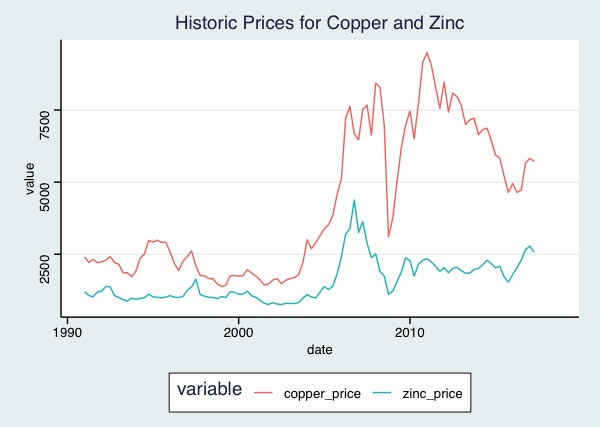
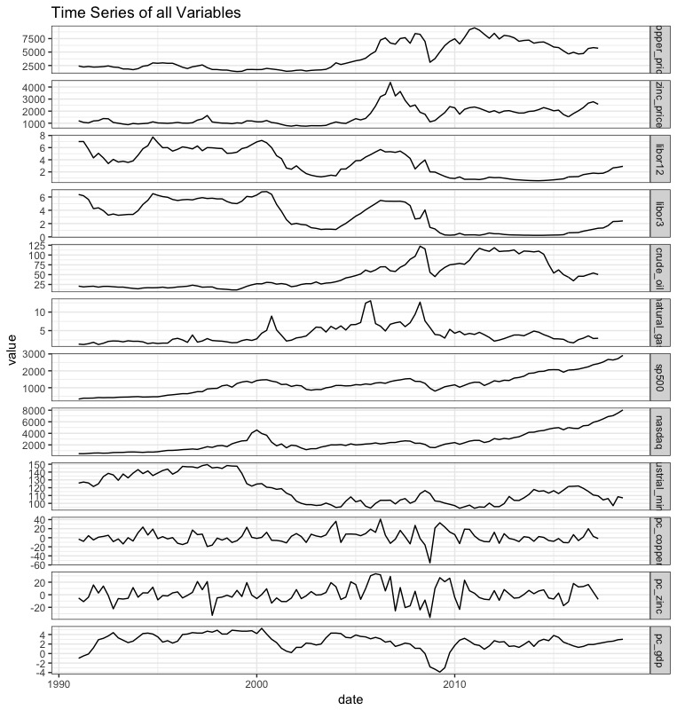
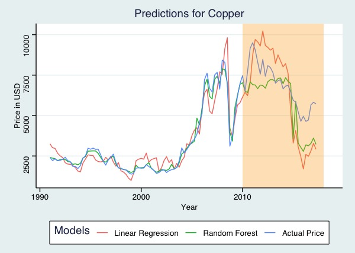

# Forecasting Copper and Zinc Quarterly Prices
Adamma Morrison
Nov 13, 2018
---

To run this project download or clone repository.  Double click the .Rproj file to start analysis.  The scripts are contained in the src folder. 

##Method: The data for the analysis was obtained from the [Federal Reserve Bank of St. Louis](https://fred.stlouisfed.org/series/PCOPPUSDQ) and Datahub.io.  Please see below for list of variables.  This analysis covers the years 1991 – 2020.

1.	Date
2.	Global price of Copper, U.S. Dollars per Metric Ton, Not Seasonally Adjusted (PCOPPUSDM)
3.	Global price of Zinc, U.S. Dollars per Metric Ton, Not Seasonally Adjusted (PZINCUSDM)
4.	12-Month London Interbank Offered Rate (LIBOR), based on U.S. Dollar, Percent, Not Seasonally Adjusted (USD12MD156N)
5.	3-Month London Interbank Offered Rate (LIBOR), based on U.S. Dollar, Percent, Not Seasonally Adjusted (USD3MTD156N)
6.	Global price of Brent Crude, U.S. Dollars per Barrell, Not Seasonally Adjusted (POILBREUSDQ)
7.	Global price of Natural Gas, US Henry Hub Gas, U.S. Dollars per Million Metric British Thermal Unit, Not Seasonally Adjusted (PNGASUSUSDM)
8.	S&P 500, Index, Not Seasonally Adjusted (SP500)
9.	NASDAQ Composite Index, Index Feb 5, 1971=100, Not Seasonally Adjusted (NASDAQCOM)
10.	Industrial Production: Mining: Copper, nickel, lead, and zinc mining, Index 2012=100, Not Seasonally Adjusted (IPG21223NQ)
11.	Global price of Copper, U.S. Dollars per Metric Ton, Not Seasonally Adjusted (PCOPPUSDM) – end of period, percent change
12.	Global price of Zinc, U.S. Dollars per Metric Ton, Not Seasonally Adjusted (PZINCUSDM) – end of period, percent change
13.	Real Gross Domestic Product, Percent Change from Quarter One Year Ago, Seasonally Adjusted (A191RO1Q156NBEA)

##Step 1- Data Preparation – 01_data_cleaning.R

The original dataset from the bank contained 111 observations of 13 variables.  S&P500 information was missing for 1991 – 2008, and was filled in from  datahub.io.
There were 5 rows with missing information for percent change zinc, percent change copper, natural gas, crude oil, zinc price, and copper price.  These 5 rows were for the dates 2017-07-01 to 2018-07-01.

The script for this step generates a file called cleaned_data.csv.  This file will be used to build our models.
 
##Step 2 – Exploratory Data Analysis – 02_eda.R

This script will perform exploratory data analysis, and generate graphs of the cleaned dataset.  

A quick look at the time series for all variables shows the price for zinc and copper seems to be most closely related to LIBOR rate.  The London Interbank Offered Rate is the rate of interest for wholesale money markets in London.  This input was included in the model because [Bilal Zonjy](https://bilalzonjy.github.io/432/index.html) found it to be a good predictor of copper prices.  Our models will include the 3 month and 12 month LIBOR rates.

The correlation graph shows which inputs are positively and negatively correlated with each other.  Blue means negative correlation; as one variable increases the other one decreases.  Red means positive correlation; as one variable increases so does the other.  
	The prices for zinc and copper are strongly correlated with each other (0.82), and as expected, so are the NASDAQ and SP500 (0.96).  Copper’s and zinc’s prices are strongly negatively correlated with industrial mining production for precious metals, crude oil price, and the LIBOR rate. This mean that when the LIBOR rate is higher, so is the price for crude oil.  During these times, the price for zinc and copper are low.  This inverse relationship between metal and crude oil price is interesting, and should be further explored.

##Step 3 – Model Building – 03_model_building.R

	Separate models were made for zinc and copper price with the following four algorithms.

1.	Simple Linear Regression – this is the simplest kind of model, and is the easiest to interpret.  It will serve as a baseline for comparison.  These regression models did not include the percent change variables.  There variables are related to zinc and copper price, and linear regression models do not work with highly correlated predictors.  See <https://en.wikipedia.org/wiki/Multicollinearity> for explanation.
2.	ARIMA Time Series Forecasting – See <https://www.statmethods.net/advstats/timeseries.html> for explanation
3.	Neural Network Time Series Forecasting – See <http://kourentzes.com/forecasting/2017/02/10/forecasting-time-series-with-neural-networks-in-r/> for explanation.  Neural networks are a deep learning algorithm, and often do well with nonlinear data.  Our dataset is a bit small for this method, but we will try it any way.
4.	Random Forest Model – Our models combine 600 decision trees.

##Step 4 – Model Evaluation – 04_model_evaluation.R

This step looks at the predictions for each model to determine which one is the best.  You can run this script to see predictions and test the models.

The blue line shows the true price of zinc and copper.  The simple linear regression model has the most error.  It dramatically overpredicts values before 2015, and underpredicts values afterwards.  The random forest models are better predictors for both copper and zinc.  Future analysis should explain why the price of zinc increased in 2016.

##Conclusion

Linear regression is not a good fit for the data, and the predictions from the ARIMA model are too broad.  The Neural Network and Random Forest models are promising, but they need more data.  There is not enough information to build a model that predicts quarterly prices.  Instead the analysis should be repeated with either bi-monthly or daily prices. Deep learning techniques need a lot of data in order to build a good model.  

Suggestions for future analysis:
Python and the Keras or Tensorflow library should be used to build a Long short-term memory (LSTM) model with either daily or monthly prices. 

